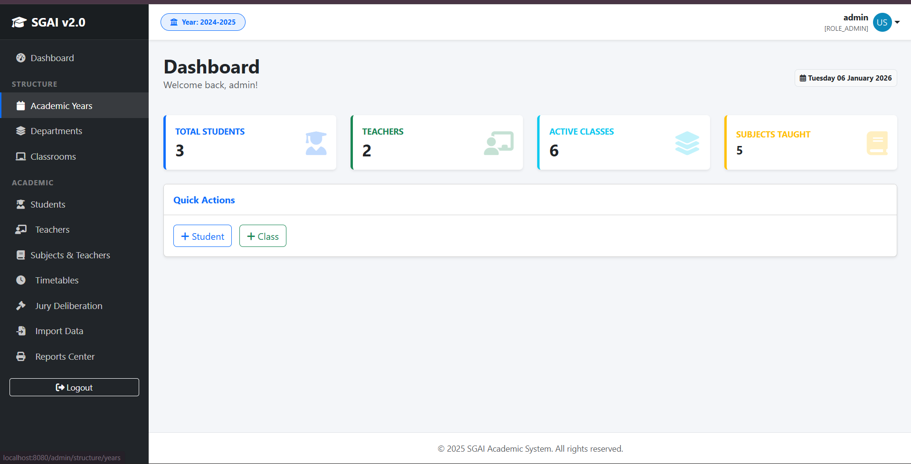
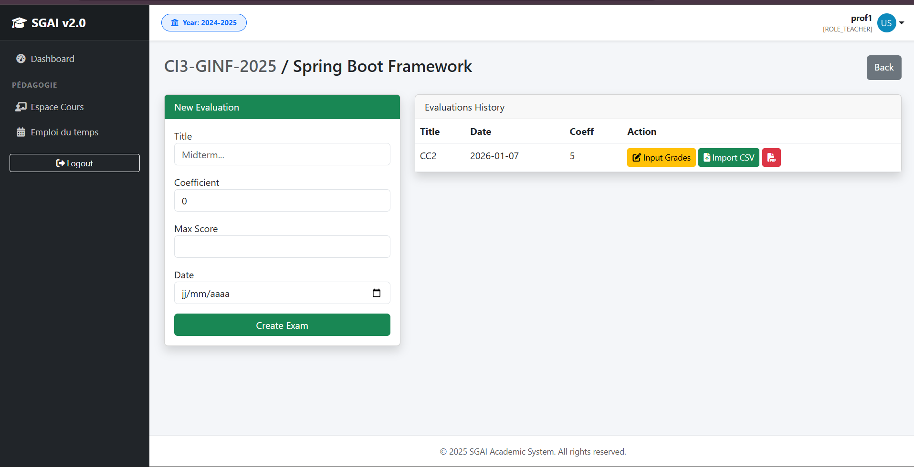
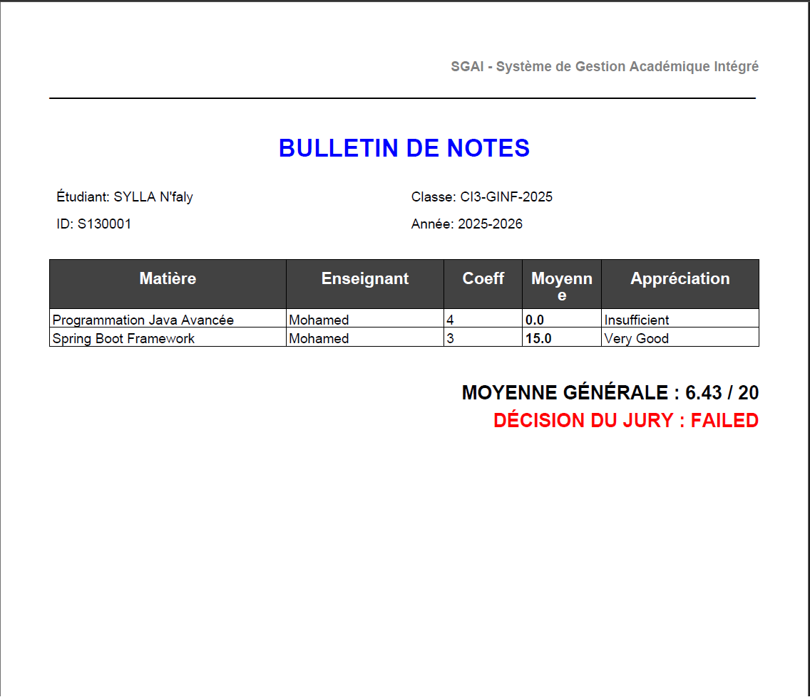
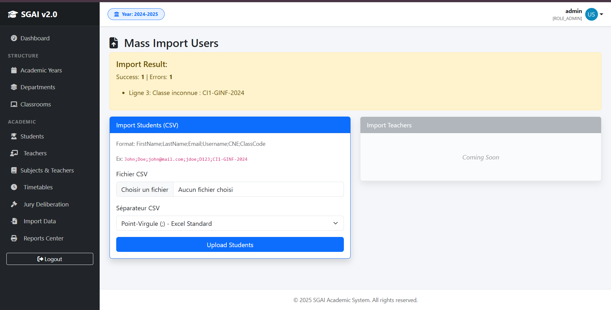
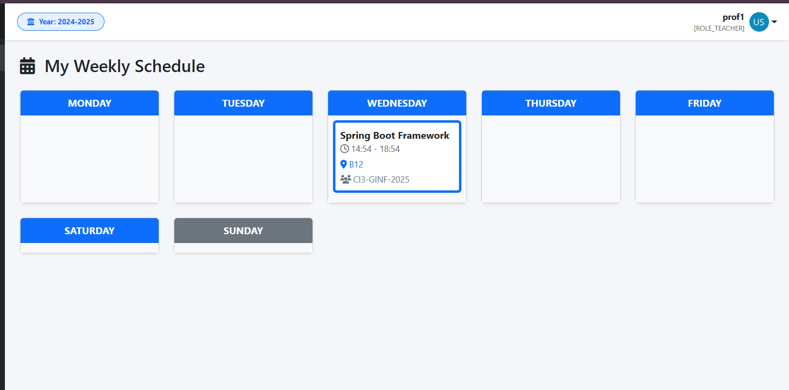

# 🎓 SGAI - Système de Gestion Académique Intégré


> **ERP Scolaire Complet** : Une solution robuste pour la gestion administrative, pédagogique et la vie scolaire d'un établissement d'enseignement supérieur (Cycle Préparatoire & Ingénieur).

---

## 📝 Contexte & Objectifs

Le projet **SGAI** vise à digitaliser l'ensemble des processus d'une école d'ingénieurs. Contrairement à un simple CRUD, ce système gère des règles métiers complexes :
*   **Calcul de moyennes pondérées** et génération automatique de bulletins.
*   **Gestion des emplois du temps** avec détection de conflits.
*   **Suivi d'assiduité** et génération de rapports PDF officiels.
*   **Sécurité RBAC** (Role-Based Access Control) stricte.

---

## Architecture Technique

Le projet respecte scrupuleusement l'architecture **N-Tiers** et les principes **SOLID**.

| Couche | Technologie | Description |
| :--- | :--- | :--- |
| **Présentation** | Thymeleaf, Bootstrap 5 | Rendu côté serveur (SSR), Layouts dynamiques, Design Responsive. |
| **Contrôle** | Spring MVC | Gestion des routes, Validation des DTOs, Gestion globale des exceptions. |
| **Métier (Service)** | Spring Core | Logique transactionnelle (`@Transactional`), Algorithmes de calcul, Injection de dépendances. |
| **Persistance** | Spring Data JPA | Abstraction ORM, Hibernate, Requêtes JPQL optimisées. |
| **Sécurité** | Spring Security 6 | Authentification, Hachage BCrypt, Protection CSRF, Filtres HTTP. |
| **Base de Données** | H2 (In-Memory) | Base relationnelle pour le développement (facilement migable vers MySQL/PostgreSQL). |

**Librairies Annexes :**
*   **Lombok** : Réduction du code boilerplate.
*   **OpenPDF** : Moteur de génération de PDF (Bulletins, Certificats).
*   **OpenCSV** : Parsing et validation pour l'importation de masse.

---

## ✨ Fonctionnalités par Acteur

### 🔴 Administrateur (ADMIN)
*   **Configuration Structurelle** : Création des Années Universitaires (Active/Archive), Filières (GSR, GINF...), et Classes.
*   **Gestion Utilisateurs** : CRUD complet des Professeurs et Étudiants.
*   **Import de Masse** : Hub d'importation CSV résilient (gestion des erreurs ligne par ligne) pour inscrire des centaines d'étudiants.
*   **Planification** : Création des emplois du temps (Matière, Salle, Horaire).
*   **Délibération** : Vue globale des résultats par classe, validation finale des bulletins (Jury).

### 🟢 Enseignant (TEACHER)
*   **Espace Pédagogique** : Vue filtrée sur ses propres matières.
*   **Évaluation** : Création d'examens et saisie des notes (interface grille).
*   **Assiduité** : Feuille d'appel numérique (Présent/Absent/Retard).
*   **Exports** : Téléchargement de la liste de classe et des feuilles de notes.
*   **Planning** : Consultation de son emploi du temps personnel.

### 🔵 Étudiant (STUDENT)
*   **Dossier Académique** : Consultation des notes en temps réel.
*   **Documents Officiels** : Téléchargement du Bulletin de notes (PDF) et Certificat de Scolarité (PDF).
*   **Suivi** : Historique des absences et emploi du temps de sa classe.

---

## 🗄 Modèle de Données (JPA)

Le modèle utilise une stratégie d'héritage **`JOINED`** pour les utilisateurs, garantissant l'intégrité des données.


*   `AppUser` (Abstrait) ➜ `Student`, `Teacher`, `Admin`.
*   `AcademicYear` (1) ➜ `Classroom` (N).
*   `Classroom` (1) ➜ `Student` (N) & `Subject` (N).
*   `Subject` (Matière) est liée à un `Teacher` et une `Classroom`.
*   `Evaluation` (1) ➜ `Grade` (N).
*   `Attendance` gère la relation ternaire (Student, Subject, Date).

---

## Installation & Démarrage

### Pré-requis
*   JDK 17 ou supérieur.
*   Maven 3.6+.

### 1. Clonage & Compilation
```bash
git clone https://github.com/8sylla/ensat_school.git
cd ensat_school
mvn clean install
```

### 2. Lancement
```bash
mvn spring-boot:run
```

### 3. Accès
*   **URL** : `http://localhost:8080`
*   **Comptes de test (générés au démarrage)** :
    *   **Admin** : `admin` / `1234`
    *   **Prof** : `prof1` / `1234`
    *   **Étudiant** : `student1` / `1234`

> **Note :** Une classe `DataSeeder` initialise automatiquement la structure de l'école (Filières, Classes, Users) au démarrage pour faciliter les tests.

---

## 📂 Structure du Projet

```
src/main/java/com/school/sgai
├── controllers/          # Gestion des requêtes HTTP (Web Layer)
│   ├── AdminController.java
│   ├── TeacherController.java
│   ├── ...
├── services/             # Logique Métier & Transactionnelle
│   ├── AcademicService.java
│   ├── TranscriptService.java
│   ├── ReportPdfService.java
│   ├── ...
├── repositories/         # Accès Données (Spring Data JPA)
├── entities/             # Modèle de Données (JPA Entities)
├── dto/                  # Objets de Transfert (Data Transfer Objects)
├── security/             # Configuration Spring Security
└── enums/                # Énumérations (Role, AbsenceStatus...)
```

---

## 📸 Captures d'Écran

### 1. Dashboard Admin (KPIs Dynamiques)


### 2. Gestion des Notes (Espace Professeur)


### 3. Bulletin de Notes PDF (Généré)


### 4. Hub d'Importation CSV


### 5. Emploi du Temps Hebdomadaire

